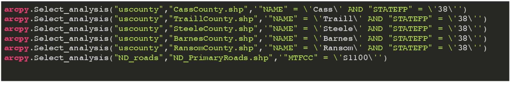
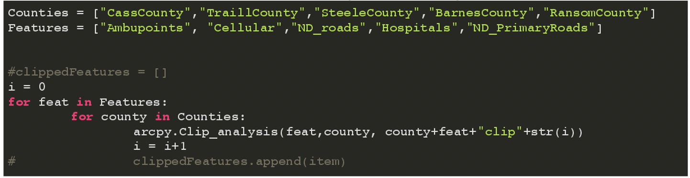
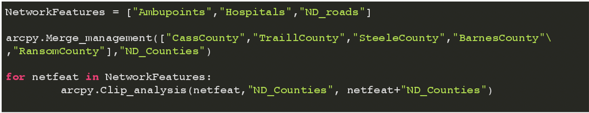
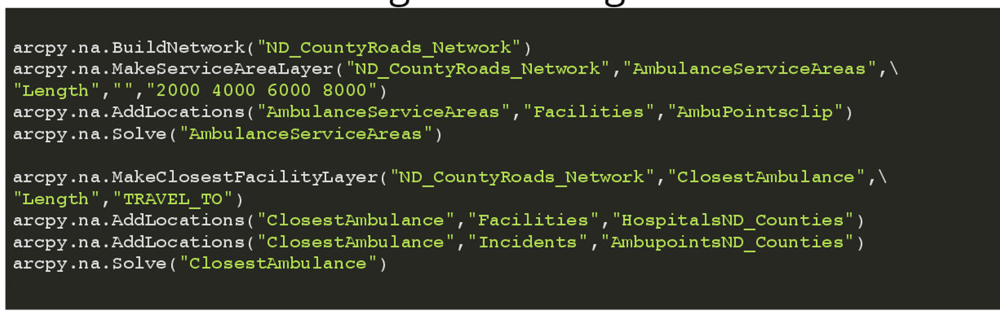
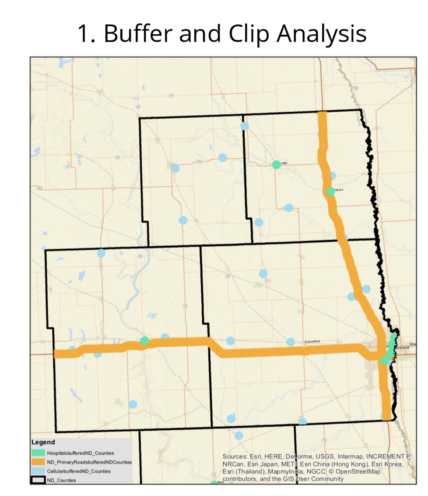
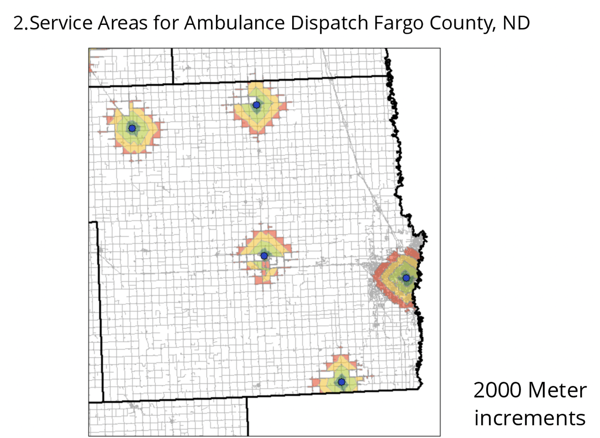
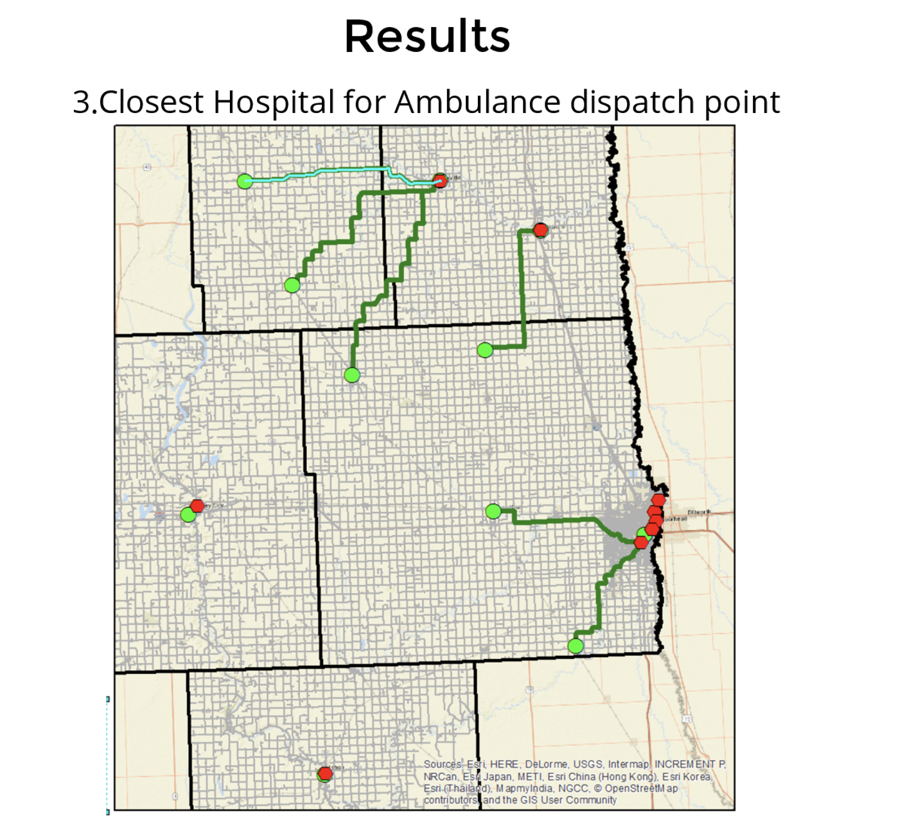

# automate_gis_python
### Goal:
* Automating repetivte workflow tasks as my time as a GIS Data Analyst. 
  * Apply Buffers and clips ot data as it comes in 
  * Using network analyst to expand ways to find critcal service areas.
  
Before Time to Complete Analyis: 
  Per State 30 hours each time a new model and map needed to be made as a manual process.
After Time to Compelte Analysis:
  Programatically - 2 Hours to Run on Computer with similar large datasets with no 

  
### Logic Design: 
* 1. Select Analysis --> 2. Loop through Buffer and Clip Analysis --> 3. Network Analyst for Service Area and Nearest Faclity
1. Using select_analysis in arcpy utilizing SQL within the python script to extract counties and specific attributes. 
 * can be easily edited to use a lookup list or dictonary whenever the data becomes larger.

2.1 Create Lists and Loops for Clip and Buffer
  * One example of lists and loops used in the script
  * Double for loop to clip each feature to each countya nd rename with clip + int
  

2.2 Setting up Features for Network Analyst Function
  * Clipping hospitals, roads, and abulance dispatch points for a specfic county layer 
  

  
3. Building and solving Network
 * 1 manual stpe of creating the road network a short coming of ArcGIS 
 * Created service areas based on 2000 meter increments
 * Created Closet Hospital routes using length 

 
### Results

1. 
2. 
3. 

